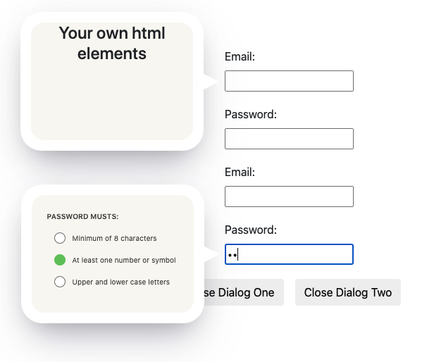

# Dialog Verification

`dialog-verify`  Performant dialog popup that lets the users know when input fields pass tests you give to the dialog, or use as information dialog for when user clicks on input field dialog will animate to and open with given message you want.  

## Installation Instructions
* clone or download
* bring in the script and defer in the head of document. run the script.js 
* bring in the stylesheet.css
* Or use both from cdn link:
```
<script src="https://cdn.jsdelivr.net/gh/bradicalone/dialog@latest/dist/index.min.js"></script>
<link rel="stylesheet" href="https://cdn.jsdelivr.net/gh/bradicalone/dialog@latest/dist/stylesheet.css">
```


## Getting Started
### Creating the varification dialog
Creating a varification dialog is extremely simple! To create a new dialog with ..., all we need to do is create a dialog with your dialog element parameter, create the few html elements for each dialog used. After the dialog is created, we can use the methods off of it.


### The markup for the dialog
```html
<div class="Dialog">
    <div class="Dialog__inner">
        <div class="Dialog__layout">
            <!-- Your html elements in here -->
        </div>
        <span class="Dialog__arrow"></span>
    </div>
</div>
```

### Example input fields to verify 
```html
    <div>
        <label for="email">Email:</label><br>
        <!-- Inputs are unique per Dialog -->
        <input class="two" type="text" id="email" name="email"><br>
        <label for="pwd">Password:</label><br>
        <!-- Inputs are unique per Dialog -->
        <input class="two" type="password" id="pwd" name="pwd">
    </div>
```

### Example using the varification dialog
```javascript
const dialogElement = document.querySelector('.Dialog')
const verification = new DialogVarify(dialogElement)
// Open dialog 
const input = document.querySelector('input')  👈   // Dialog will animate to the input field attached to the click handler
input.addEventListener('click', (e) => verification.open(e)) 👈  // open method needs to have the Event (e) passed to it

// Close dialog
const closeButton = document.querySelector('button')
closeButton.addEventListener('click', (e) => verification.close(e))
```

### Example using the varification dialog with built in varification
```javascript
const dialogElement = document.querySelector('.Dialog')

/*
* Using built in varification method second parameter needs to be supplied. 
*
* @param {HTMLElement} html element of the dialog
* @param {Array} Array of string input elements you wish to use
*/
const verification = new DialogVarify(dialogElement, ['email', 'password'])

// Open dialog 
const input = document.querySelector('input')  👈   // Dialog will animate to the input field attached to the click handler
input.addEventListener('click', (e) => verification.open(e))  👈  // open method needs to have the Event (e) passed to it

/*
* Using built in varification
*/
input.addEventListener('input', (e) => verification.checkValidation(e))

// Close dialog
const closeButton = document.querySelector('button')  👈   // Dialog will animate to the input field attached to the click handler
closeButton.addEventListener('click', (e) => verification.close(e)) 👈  // close method needs to have the Event (e) passed to it
```


### Example using multiple varification dialogs in a single page with varification elements

```html
<div class="container">
    <div>
        <label for="email">Email:</label><br>
        <!-- Input are unique per Dialog -->
        <input class="first" type="text" id="email" autocomplete="off" name="email"><br>
        <label for="pwd">Password:</label><br>
        <!-- Input are unique per Dialog -->
        <input class="first" type="password" autocomplete="off" id="pwd" name="pwd">
    </div>
    <div>
        <label for="email">Email:</label><br>
        <!-- Input are unique per Dialog -->
        <input class="two" type="text" id="email" autocomplete="off" name="email"><br>
        <label for="pwd">Password:</label><br>
        <!-- Input are unique per Dialog -->
        <input class="two" type="password" autocomplete="off" id="pwd" name="pwd">
    </div>
    <div class="Dialog" id="one">
        <div class="Dialog__inner">
            <div class="Dialog__layout">
                <h4 style="text-align: center;">Your own html elements here..</h4>
            </div>
        </div>
        <span class="Dialog__arrow"></span>
    </div>
    <div class="Dialog" id="two">
        <div class="Dialog__inner">
            <div class="Dialog__layout">
                <!-- Using built in Varification -->
            </div>
        </div>
        <span class="Dialog__arrow"></span>
    </div>
    <div style="display: flex; gap: 1rem">
        <button class="btn close-dialog" id="close-one">Close Dialog One</button>
        <button class="btn close-dialog" id="close-two">Close Dialog Two</button>
    </div>
</div>
```

```javascript
// Frist example simplest using your own logic possibly for just information of an element for the user to read.
const dialogElement = document.querySelector('.Dialog#one')
const dialogOne = new DialogVarify(dialogElement)

const targetsOne = Array.from(document.querySelectorAll('input.first'))
targetsOne.forEach(target => {
    target.addEventListener('click', (e) => dialogOne.open(e))
    target.addEventListener('input', (e) => {
        // Your own logic...
    })
})

//  Second example using built in varification for email or password 
const anotherDialogElement = document.querySelector('.Dialog#two')
const targetsTwo = Array.from(document.querySelectorAll('input.two'))

/* 
* @param {HTMLElement} the dialog element
* @param {Array} Array of string input elements you wish to use
*/
const dialogTwo = new DialogVarify(anotherDialogElement, ['email', 'password'])

targetsTwo.forEach(target => {
    target.addEventListener('click', (e) => dialogTwo.open(e))
    target.addEventListener('input', (e) => {
        // Validate your input fields
        dialogTwo.checkValidation(e)
    })
})

/* Close dialog from buttons */
const closeBtns = Array.from(document.querySelectorAll('.close-dialog'))
closeBtns.forEach(close =>
    close.addEventListener('click', (e) => {
        if (e.target.id === 'close-one') {
            return dialogOne.close(e)
        }
        dialogTwo.close(e)
    })
);
```

### Current Example:

